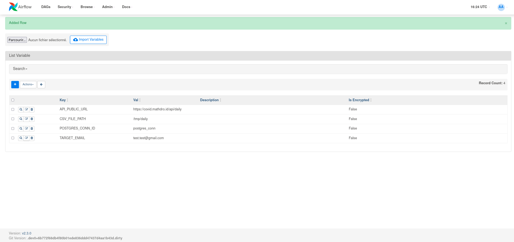
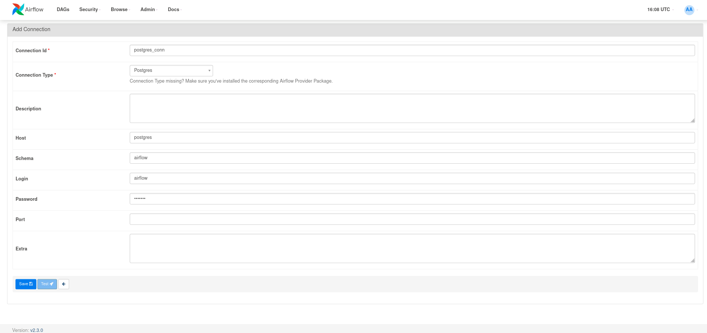
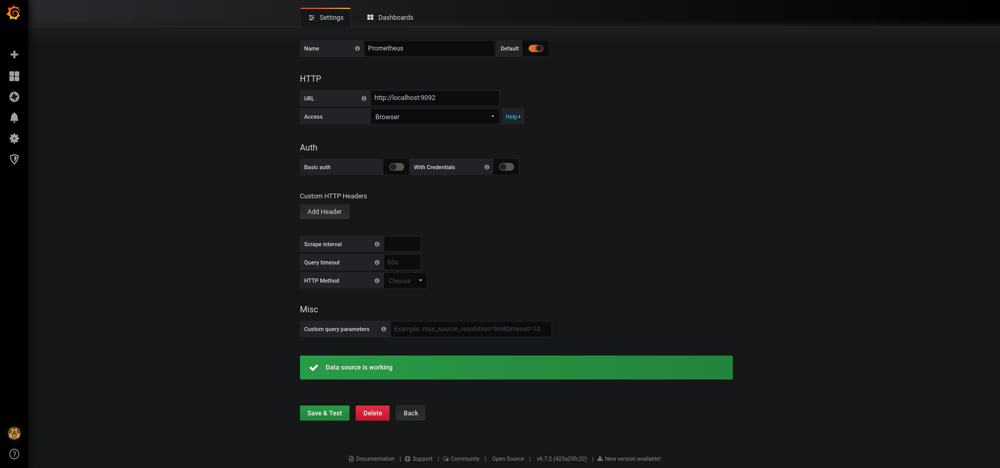
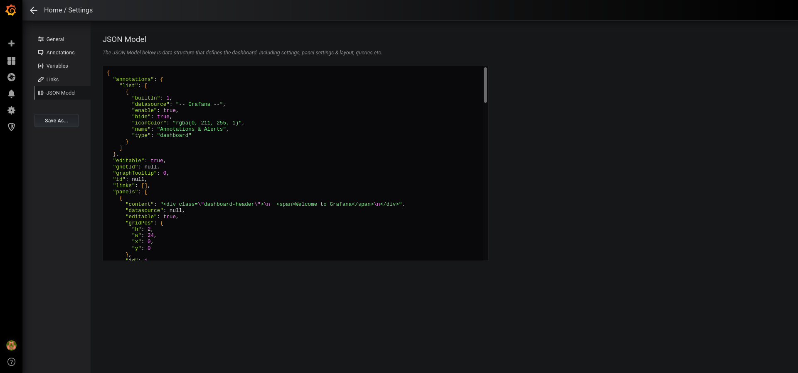
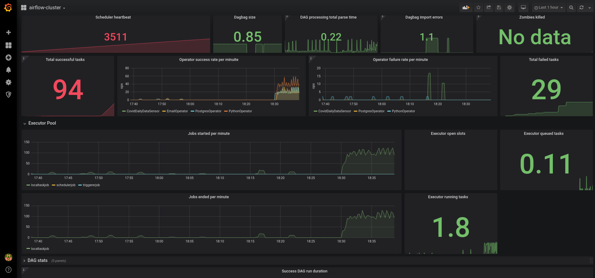
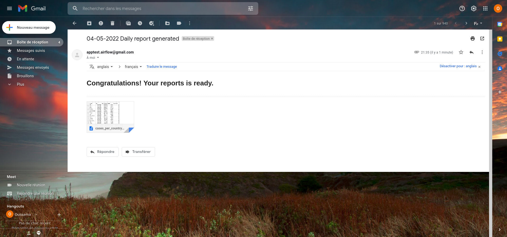
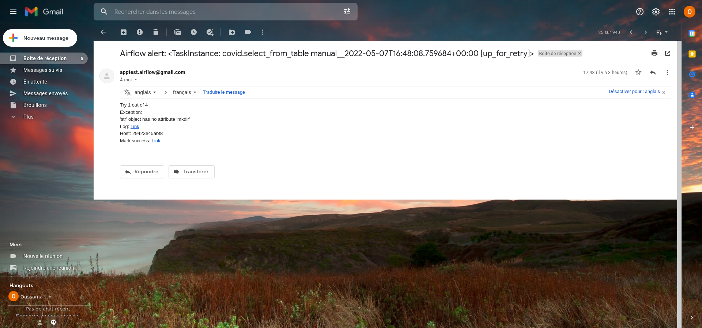

#  DATA OPS Airflow POC Documentation

A POC to test Airflow setup, capabilities and monitoring.

Refer to the [specifications document](SPEC.md) for more details about the system's features and structure.

## I) TECHNICAL OVERVIEW

### Solution Architecture

The solution is composed of:

1. **airflow-webserver** Web Client 
2. **airflow-worker** Task Executor
3. **Postgres** Relational Database
5. **Redis** Message Broker
6. **airflow-scheduler** Workflow Scheduler 
7. **flower server** monitor and administer the Celery cluster
8. **StatsD** metrics collector
9. **Prometheus** metrics exporter
10. **Grafana** Airflow Cluster Monitoring Dashboard

---

## II) REPOSITORY STRUCTURE

This project's source code, while split over multiple orthogonal modules, is managed following the "monorepo" pattern. The directory structure is as follows:

```bash
.
|-- Dockerfile                        # Dockerfile to extend the original Airflow image 
|-- configs                           # Config files needed 
|   |-- prometheus.yaml               # Prometheus Config file
|   `-- statsd.yaml                   # StatsD mappings file
|-- dags                              # Dags (Data pipelines)
|   |-- daily_covid_dag.py            # Main dag (Actual data pipeline)
|   `-- trigger_hooks.py              # Helper methods
|-- logs                              # Folder to be mounted inside the image to persist logs
|-- plugins                           # Everything related to custom plugins (sensors, hooks, operators)
|   `-- custom_plugin.py              # Custom plugin 
|-- requirements.txt                  # needed pip packages
`-- sql_files                         # Everything related to SQL scripts to be used with `PostgresOperator`
    `-- create_table.sql              # Table creation SQL script
├── docker-compose.yaml               # local development docker-compose services (Celery Executor)
├── README.md                         # main documentation page
├── SPEC.md                           # basic specification document
└── CONTRIBUTING.md                   # contributing guidelines
```

---

## III) DEVELOPMENT SETUP

The local development setup is based on a docker-compose configuration containing the services:

- `postgres`
- `redis`
- `Adminer` UI accessible on `localhost:5050` (depends on `postgres`)
- `Airflow` Web UI endpoints accessible on `localhost:8080` (depends on `postgres`)
- `scheduler` (depends on `Redis`)
- `Flower` UI accessible on `localhost:5555`
- `StatsD` UI accessible on `localhost:9102`
- `Prometheus` UI accessible on `localhost:9092`
- `Grafana` Dashboards accessible on `localhost:3000`

### Prerequisites
1. Install Docker
2. Install Docker Compose `(required: Version>=1.29)`
3. In this Data Pipeline, Email Operator is used for Notification and alerting. A dummy `Email` and `password` are used as shown in the `docker-compose` file: 

   ```bash
    AIRFLOW__SMTP__SMTP_HOST: smtp.gmail.com
    AIRFLOW__SMTP__SMTP_USER: ***********
    AIRFLOW__SMTP__SMTP_PASSWORD: durhbcvjylodttgh
    AIRFLOW__SMTP__SMTP_PORT: 587
    AIRFLOW__SMTP__SMTP_MAIL_FROM: Airflow
   ```

    If new Email and password needs to be configured Please refer to this [guide](https://support.google.com/mail/answer/185833?hl=en). and update the variables:

   ```bash
    AIRFLOW__SMTP__SMTP_USER: NEW_EMAIL
    AIRFLOW__SMTP__SMTP_PASSWORD: NEW_APP_PASSWORD
   ```

4. **Note:** In case you face any `permission denied` issues when mounting the different folders in their respective docker images: 

    1- Rcerate the different folders: 
    ```bash
        mkdir ./dags ./logs ./plugins ./configs
        echo -e "AIRFLOW_UID=$(id -u)\nAIRFLOW_GID=0" > .env
    ```
    2- Copy paste the files inside the newly created folders

    Please refer to the Airflow [documentation](https://airflow.apache.org/docs/apache-airflow/stable/start/docker.html#setting-the-right-airflow-user).

### Running Containers
 
1. Start by inistializion airflow:
    ```bash
        docker-compose up airflow-init
    ```
2. Start application component images:
    ```bash
        docker-compose up 
    ```
    If you updated the Dockefile file, Please append `--build` flag to the two previous commands.

3. Before starting the workflow: 
   - Set the needed variables from the Airflow UI: 
    ```bash
        - `API_PUBLIC_URL`           # API URL to download Covid data
        - `CSV_FILE_PATH`            # Local path where to save daily report 
        - `POSTGRES_CONN_ID`         # Postgres connection ID to be used with the postgres operator and hook
        - `TARGET_EMAIL`             # The target email to receive the notifications
    ```

    

    - Create Postgres Connection using same `POSTGRES_CONN_ID` chosen: 

    

4. Trigger the workflow

### AF Health - Monitoring - Build the Grafana dashboard

1. Open the Grafana UI accessible on `localhost:3000`

2. Add **data source**: prometheus: 

3. Build Dashboard: 
   Copy this [cluster-dashboard.json](https://github.com/databand-ai/airflow-dashboards/blob/main/grafana/cluster-dashboard.json) in the json model section.

4. Check built dashboard


This section exposes different metrics as specified in the Airflow [documentation](https://airflow.apache.org/docs/apache-airflow/stable/logging-monitoring/metrics.html). These metrics are specified in this [mapping](configs/statsd.yaml) file. 

### Email Alering and notifications
1. On Success


2. On failure

