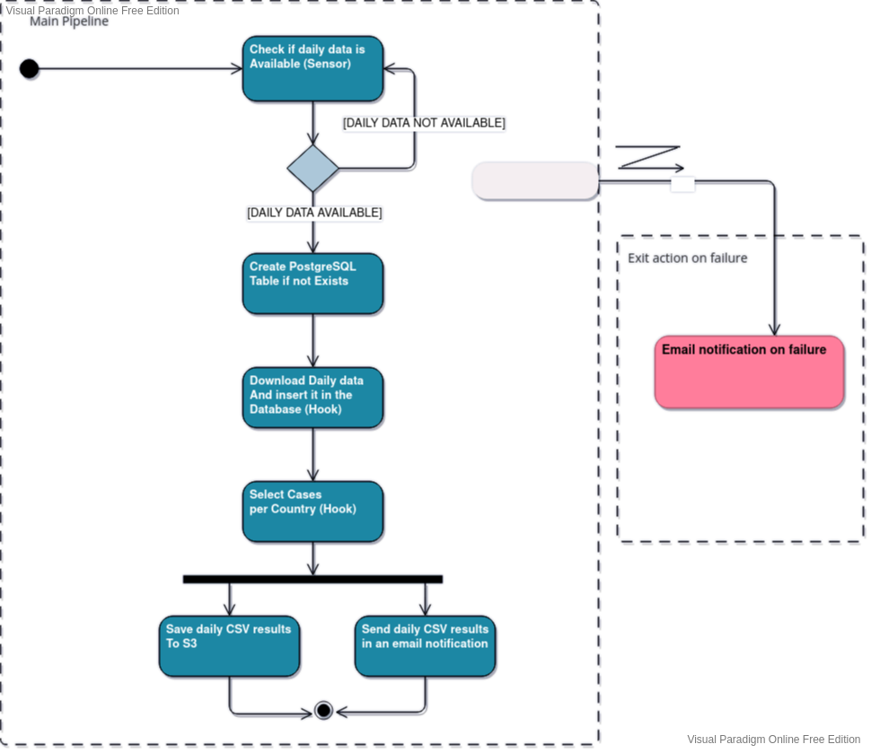
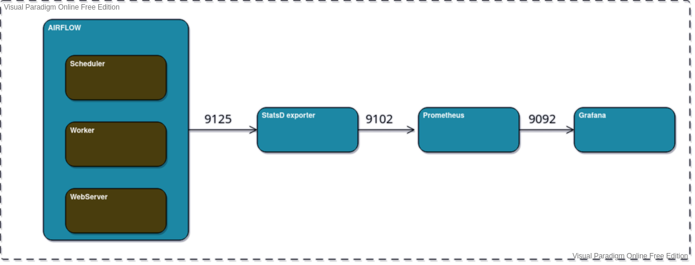

# Project Requirement Specifications Document

## CONTENTS:

Project Specifications: overview of the project’s objectives and delivery

System Modeling: design of the system's behavior and structure

Feature Specifications: detailed description of the system’s features

## I) PROJECT SPECIFICATIONS

### Objective

This is a POC to setup an airflow cluster, Create an example data pipeline and explore the different features of airflow from creating custom plugins (sensors, hooks, operators) to notification and alerting and monitoring of the different airflow system components.

---

## II) SYSTEM MODELING

### Core Workflow

The core workflow runs an automated daily tasks to check download and analyse COVID DATA:

### Monitoring Airflow with Prometheus, StatsD and Grafana

## III) CORE FEATURE DETAILS

In this POC, a different advanced features of Airflow are explored: 

1. The process is **repeatable** and **automatic** that runs on a daily basis and keeps checking for available data until it gets available for use.
2. Different type of jobs executed (multiple `operators` used): ** Email, PostgreSQL, python scripts** used.
3. Airflow `connections` and `variables` used
3. Postgres `Hook` used to connect to the DB instance 
4. XCOMS
5. **Custom plugins** created (`./plugins/custom_plugin.py`):
    - 1. `CovidDailyDataSensor` a custom sensor implemented that extends `BaseSensorOperator` of airflow to ping the API on a regular intervals to check if the daily data is made available to run the rest of the pipeline or keep checking. 
    - 2. `APIToPostgreSQLHook` a custom hook that extends airflow's `BaseHook` To download, process and insert the daily data into a postgres table
    - 3.  `PostgreSQLToCsv` another custom hook to run the daily analysis of frouping cases per country and save it to a `CSV` file

6. Email `notification` on **failure** and on **success** activated
7. System **monitored** using `flower` and `grafana dashboards`
